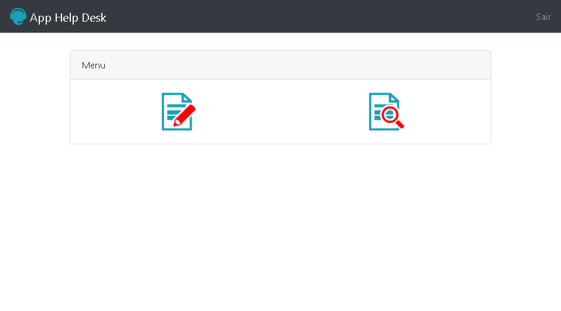

# create help desk app

to deepen knowledge in php, we created a help desk app where you have the option to open and view tickets.

through the login it is possible to make the decision of the information that certain users can view.

## 🚀 starting

created through a web development course.

### 🔧 challenge  

- using get and post methods
- authenticate user
- restrict pages with session
- embedding scripts through require and require_once
- logoff
- register calls
- consult calls
- backend security

## 🛠️ built with

* bootstrap  
* php

## ✒️ author

⌨️ with ❤️ per [becardine](linkedin.com/in/becardine/)

## 🎁 acknowledgments

* if you made it this far, thank you very much. 📢
